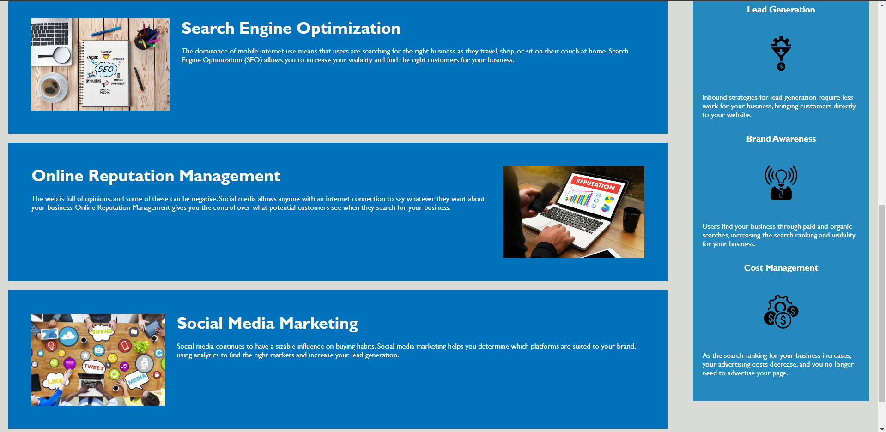

# <Horiseon-Info-Website>

## Description

- The motivation for this project was to facilitate the navigation methods present in the webpage, while also sharpening the broad accessibility options available in the source code.
- This project was created so that potential Horiseon clients would have a reliable navigation bar and people who need the various accessibility options would have them.
- My edits to the starter code solved the broken link in the navigation bar and added in detailed comments breaking down each element of the code
- Throughout this project I learned how to troubleshoot non-functional elements of the webpage as well as incorporate the broad accessibility features required by every webpage.

## Installation

N/A

## Usage

When clicking on elements in the navigation bar located in the header, your view will be relocated to the corresponding info card at the bottom of the page.

When using DevTools to inspect the source code, accurate and concise comments will detail each element of the webpage.

## Credits

N/A

## License

Please refer to license in original repo